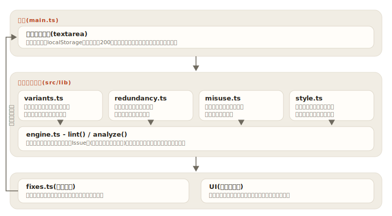

# kousei

[](https://github.com/miruky/kousei/actions/workflows/ci.yml)
[](https://github.com/miruky/kousei/actions/workflows/deploy.yml)
[](https://www.typescriptlang.org/)
[](LICENSE)

**表記ゆれ・冗長表現・誤用・文体の乱れを、文章をどこにも送らずにブラウザの中だけで検出する日本語校正ツール**

デモ: https://miruky.github.io/kousei/

## 概要

kouseiは、貼り付けた文章をその場で検査し、問題のある箇所に下線を引いて根拠つきで指摘するWebアプリである。検査は4つの観点で行う。表記ゆれは「サーバー/サーバ」「できる/出来る」のような同語異表記の混在、冗長表現は「することができる」「まず最初に」のような重言、誤用は「見れる(ら抜き)」「行かさせて(さ入れ)」「的を得る」のような語法、文体は敬体と常体の混在・100字超の長文・読点の過多・半角カタカナなどを対象とする。

多くの指摘には置換しても文意が変わらない修正案がついており、1件ずつ、またはまとめて適用できる。「確認することができました」のような活用形にも提案を合わせる。本文はlocalStorageに保存され、リロードしても消えない。

表記ゆれの扱いには特徴がある。「サーバ」という表記は単独では正しく、同じ文書に「サーバー」が混ざって初めて問題になる。そこでパターン照合ではなく文書全体を集計し、多数派の表記を基準に少数派の出現箇所だけを指摘する。同数の場合は辞書の先頭に定義した表記を基準にする。

### なぜ作ったのか

文章校正のWebサービスは本文をサーバーに送るものが多く、社外秘の文書や未公開の原稿を貼るのはためらわれる。kouseiは検査ロジックの全部をブラウザ内で完結させ、ネットワーク通信を一切しない。また、既存ツールの指摘は「ら抜き言葉です」で終わりがちで、なぜ問題なのか・どう直すのかまで言わないものが多い。本ツールは全規則に根拠の説明を持たせ、機械的に直せるものには活用形を合わせた修正案を付けた。

## アーキテクチャ



## 技術スタック

| カテゴリ             | 技術                                 |
| :------------------- | :----------------------------------- |
| 言語                 | TypeScript 5(strict、実行時依存ゼロ) |
| ビルド               | Vite 6                               |
| テスト               | Vitest(node環境、68ケース)           |
| リンタ・フォーマッタ | ESLint(typescript-eslint)+ Prettier  |
| CI / 配信            | GitHub Actions / GitHub Pages        |

## 使い方

### 検査する

```ts
import { lint } from './src/lib';

const issues = lint('サーバーの設定はサーバの管理画面から変更することができます。');
// issues[0] => {
//   ruleId: 'variant/server', category: 'variant',
//   text: 'サーバ', suggestion: 'サーバー',
//   message: '表記ゆれ。「サーバ」と「サーバー」が混在している。本文の基準は「サーバー」',
//   start: 8, end: 11,
// }
// issues[1] => {
//   ruleId: 'redundancy/suru-koto-ga-dekiru', category: 'redundancy',
//   text: 'することができます', suggestion: 'できます', ...
// }
```

`Issue` の `start` / `end` はUTF-16コード単位の位置で、常に `text.slice(start, end) === issue.text` が成り立つ。エディタのハイライトはこの不変条件に依存している。

### 修正を適用する

```ts
import { applyAllFixes, lint } from './src/lib';

const src = 'サーバーの設定はサーバの管理画面から変更することができます。';
const { text, applied } = applyAllFixes(src, lint(src));
// text    => 'サーバーの設定はサーバーの管理画面から変更できます。'
// applied => 2
```

重なり合う指摘は先に始まるものだけが適用対象になり、置換は後ろから行うため位置ずれは起きない。

### 統計を取る

```ts
import { analyze } from './src/lib';

const { stats } = analyze('短い報告です。問題はありません。');
// stats => { chars: 16, sentences: 2, issueCount: 0, byCategory: {...}, bySeverity: {...} }
```

## プロジェクト構成

- `src/lib/types.ts` Issue・規則・カテゴリの型定義
- `src/lib/rules/variants.ts` 表記ゆれ27グループ。文書全体の集計と熟語境界の除外
- `src/lib/rules/redundancy.ts` 重言・冗長表現12規則
- `src/lib/rules/misuse.ts` ら抜き・さ入れ・い抜き・慣用句誤用12規則
- `src/lib/rules/style.ts` 文体混在・長文・読点過多・文末単調・文字種の検査
- `src/lib/engine.ts` 規則の束ねとIssue列・統計への整形
- `src/lib/fixes.ts` 重なりを除外した修正適用
- `src/lib/theme.ts` 配色テーマ(自動/ライト/ダーク)の解決と保存
- `src/main.ts` ハイライト付きエディタと指摘リストのUI
- `docs/` アーキテクチャ図

## はじめ方

### 前提条件

- Node.js 22以上

### セットアップ

```bash
git clone https://github.com/miruky/kousei.git
cd kousei
npm ci
npm run dev
```

### テスト・lint・ビルド

```bash
npm test
npm run lint
npm run build
```

### デプロイ

mainへのpushで `deploy.yml` がGitHub Pagesへ公開する。サブパス配信のためのbaseは環境変数 `KOUSEI_BASE` で渡す。

配色はヘッダ右のテーマボタンで「自動(OS設定に追従)・ライト・ダーク」を順に切り替えられ、選択は次回も保たれる。描画前にテーマを解決するため再読み込みでもちらつかない。

## 制約

- 形態素解析は行わず、正規表現と辞書で検査する。そのため文脈に依存する誤検出・取りこぼしがあり、指摘は機械的に従うものではなく判断の材料として出す。
- 表記ゆれの辞書は技術文書・ビジネス文書で頻出の27グループに絞っている。固有の用語集を読み込む機能はない。
- 「的を得る」「汚名挽回」のように辞書によって許容が分かれる語は、重大度を参考(info)に落とし、メッセージにもその旨を書いている。
- 「ください/下さい」は本動詞(物をもらう)と補助動詞(依頼)の使い分けまでは判定せず、表記の混在のみを指摘する。

## 設計方針

- **文章を外に出さない** — 検査・修正・保存のすべてがブラウザ内で完結する。校正対象は未公開の文章であることが多く、これを最優先の制約にした。
- **指摘には根拠と直し方を添える** — 全規則がメッセージに「なぜ問題か」を持ち、機械的に直せるものは活用形を合わせた `suggestion` を持つ。提案できない指摘は無理に直さず参考情報に留める。
- **表記ゆれは文書全体で判定する** — 単独の出現を正誤で裁かず、混在して初めて指摘する。基準は文書内の多数派で、書き手の選好を尊重する。
- **誤検出より取りこぼしを選ぶ** — ら抜き・さ入れ・い抜きは語幹の列挙で検出し、「見れば(仮定形)」「説明させて(サ変使役)」のような正しい形を巻き込まない。網羅性は下がるが、信頼できない指摘は1件でもツール全体の信頼を損なう。
- **検出器は純関数** — 規則はすべて `text -> Issue[]` の純関数で、DOMに依存しない。68ケースのテストは位置の不変条件・活用形の提案・誤検出の不在を検査する。

## ライセンス

[MIT](LICENSE)
